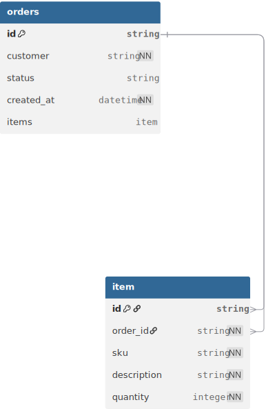

## Entidades

### Tabela: orders

| Coluna | Tipo | Descrição |
|--------|------|-----------|
| id | string | Identificador único gerado com uuidv4 |
| customer | string | Nome do cliente não pode ser nulo |
| status | string | Status do pedido, inicia por padrão como open |
| created_at | datetime | Registra data e hora no momento da criação do registro |

### Tabela: items

| Coluna | Tipo | Descrição |
|--------|------|-----------|
| id | string | Identificador único gerado com uuidv4 |
| order_id | string | Foreign key referência orders.id na tabela orders |
| sku | string | Código sku não pode ser nulo |
| description | string | Descrição do item do pedido e não pode ser nulo |
| quantity | integer | Quantidade do item para o pedido |

### Relacionamento

**1:N (one-to-many)** — Um pedido pode ter vários itens e quando um pedido é deletado os itens associados também serão deletados juntos.

---

### Schema DBML
* Docs: https://dbml.dbdiagram.io/docs 

```dbml
Table orders {
  id string [primary key , default: 'uuid_generate_v4()']
  customer string [not null]
  status string [default: "open"]
  created_at datetime [not null, default: `now()`]
}

Table items {
  id string [primary key, default: 'uuid_generate_v4()']
  order_id string [not null, ref: > orders.id]
  sku string [not null]
  description string [not null]
  quantity integer [not null]
}

Ref: orders.id < items.order_id [delete: cascade]

Records orders(id, customer, status) {
  0, 'Aldenira', 'open'
}

Records items(id, order_id, sku, description, quantity) {
  0, 0, 'ABC123', 'Arroz', 2
  1, 0, 'ABC321', 'Ovos', 12
}
```

